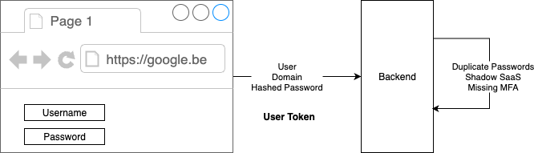
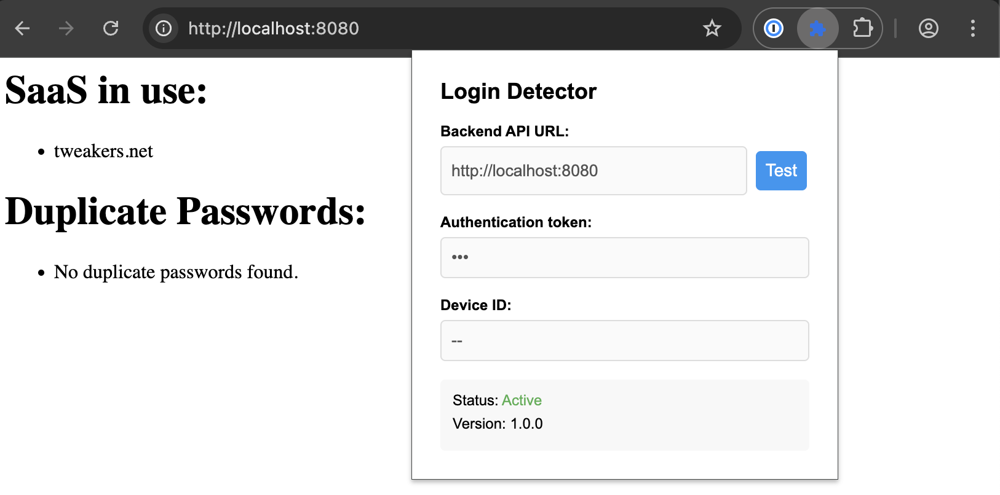
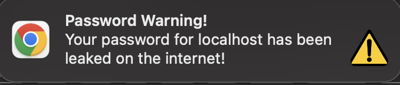

# shade

A system for detecting shadow SaaS and securely recording the credentials used.<br/>
The system consists of a Go API backend and a browser extension written in TypeScript.

The extension communicates to a backend:



And very roughly looks like this:



And integrates with HaveIBeenPwned to check your passwords (in a secure way):



## How does it work?

The browser extension is deployed to your company browsers with a secret token.
Using this token, the extension will now report any login events to a web (SaaS) application of that user to the backend.
Only events using the correct secret user token and username filter will be processed.
A typical use case is only processing email usernames for the company domain.
Every password entry will be matched to [HIBPs k-Anonymity model for password checking](https://haveibeenpwned.com/API/v3#SearchingPwnedPasswordsByRange). 

The Chrome extension configuration profile looks like this:
```json
{
  "filters": ["domain.com"], // what domains you would like to filter for in the usernames
  "locked": true, // do you allow the user to change settings, not recommended except for debugging.
  "api": "http://localhost:8080", // where is the backend located
  "id": "",       // the unique device id to use, will be randomly generated if empty
  "enabled": true,// enable or disable the extension
  "token": ""     // the secret user token that authenticates this extension
}
```

And an example configuration file for the Go backend:
```yaml
log:
  level: info

http:
    port: 8080
    interface: 0.0.0.0

storage:
    type: memory
    properties:
      token: YOUR-LONG-SECRET-TOKEN-VALUE-HERE
```
Which you could run with `shade -config=dev.yml`.

## Project Structure

- `backend/`: Go backend server
- `extension/`: Chrome extension

## Building the Project

The project includes a Makefile to simplify building and cleaning both the backend and extension.

### Makefile Commands

```bash
# build the extension and run the server locally
% make dev

# Build both the backend and extension
% make

# Clean up build artifacts
% make clean
```

## Backend

The backend is a Go HTTP server that provides API endpoints for receiving and storing login data.

### Features

- Receives login data from the Chrome extension
- Stores login data in memory (can be extended to use a database)
- Provides endpoints for retrieving login data and statistics

### API Endpoints

- `GET /api/health`: Health check endpoint (e.g. to verify browser extension token)
- `POST /api/login/register`: Registers a login event for the user (user, domain, password hash)
- `POST /api/password/domaincheck`: Verifies if the user password is being shared across other websites.

## Chrome Extension

The Chrome extension detects login events on web pages and sends the data to the backend.

### Features

- Detects login forms and submissions
- Captures domain, username, and password
- Sends data to the backend with a unique device ID
- Provides a popup UI for configuration

### Building the Extension

```bash
# Option 1: Build manually
cd extension

# Install dependencies
npm install

# Build the extension
npm run build

# Option 2: Build using the Makefile
make extension
```

### Loading the Extension in Chrome

1. Open Chrome and navigate to `chrome://extensions`
2. Enable "Developer mode" (toggle in the top-right corner)
3. Click "Load unpacked" and select the `extension` directory
4. The extension should now be installed and active

### Configuration

Click on the extension icon in the Chrome toolbar to open the popup UI. From there, you can:

- Enable/disable the extension
- Set the backend API URL
- View the device ID

## How It Works

1. The Chrome extension injects a content script into all web pages
2. The content script monitors for login forms and submissions
3. When a login event is detected, the content script captures the domain, username, and password
4. The data is sent to the background script
5. The background script adds the device ID and sends the data to the backend
6. The backend stores the data and provides endpoints for retrieving it

## Security Considerations

- The extension stores sensitive data (passwords) temporarily in memory
- The backend stores login data in memory (in a production environment, this would be replaced with a secure database)
- Communication between the extension and backend should be secured with HTTPS in a production environment
- The device ID is used to identify the source of the login data

## Testing the Extension

To test the Chrome extension and verify it's working correctly, follow these steps:

### Prerequisites

1. Make sure the backend server is running:
   ```bash
   # Start the backend server
   ./shade
   ```

2. Ensure the extension is loaded in Chrome (as described in "Loading the Extension in Chrome" section)

### Testing Steps

1. **Verify the extension is loaded properly**:
   - Check that the extension icon appears in Chrome's toolbar
   - Click on the icon to open the popup UI
   - Verify that the configuration options are displayed correctly
   - Check that the Device ID is generated and displayed

2. **Configure the extension**:
   - In the popup UI, ensure the "Backend API URL" is set to where your backend is running (default: `http://localhost:8080`)
   - Make sure the extension is enabled (toggle should be on)
   - Click "Save Settings" to apply the configuration

3. **Test login detection**:
   - **Option 1**: Use the included test page
     - Open the `extension/test-login.html` file in Chrome
     - Fill in the form with test credentials
     - Submit the form
     - Check the Console for messages from the extension

   - **Option 2**: Use any website with a login form
     - Open a new tab and navigate to a website with a login form
     - Open Chrome DevTools by right-clicking on the page and selecting "Inspect"
     - Go to the "Console" tab in DevTools
     - Fill in the login form with test credentials (username and password)
     - Submit the form
     - Check the Console for messages like "Login detected on [domain] for user [username]"

4. **Verify data is sent to the backend**:
   - After submitting a login form, check the backend server logs for messages indicating that login data was received
   - You can also verify by querying the backend API:
     ```bash
     # Get your device ID from the extension popup
     # Then use it to query the backend
     curl http://localhost:8080/api/logins?device_id=YOUR_DEVICE_ID
     ```
   - Check the response to see if your test login was recorded

5. **Check overall statistics**:
   ```bash
   curl http://localhost:8080/api/stats
   ```
   This should show the total number of logins detected and unique devices.

### Debugging Tips

If the extension isn't working as expected:

1. **Check the extension logs**:
   - Open Chrome DevTools for the background script:
     - Go to `chrome://extensions`
     - Find the Login Detector extension
     - Click "service worker" under "Inspect views"
     - Check the Console for any error messages

2. **Verify content script injection**:
   - When on a page with a login form, open Chrome DevTools
   - Go to the "Sources" tab
   - Expand the "Content scripts" section
   - Verify that the extension's content script is listed

3. **Test with a simple login form**:
   - Create a simple HTML file with a basic login form for testing:
     ```html
     <!DOCTYPE html>
     <html>
     <head>
       <title>Login Test</title>
     </head>
     <body>
       <form id="login-form">
         <input type="text" name="username" placeholder="Username">
         <input type="password" name="password" placeholder="Password">
         <button type="submit">Login</button>
       </form>
       <script>
         document.getElementById('login-form').addEventListener('submit', function(e) {
           e.preventDefault();
           alert('Form submitted!');
         });
       </script>
     </body>
     </html>
     ```
   - Open this file in Chrome and test the login detection

4. **Check backend connectivity**:
   - Verify the backend server is running and accessible
   - Check that the API URL in the extension configuration is correct
   - Test the backend API directly using curl or a tool like Postman
